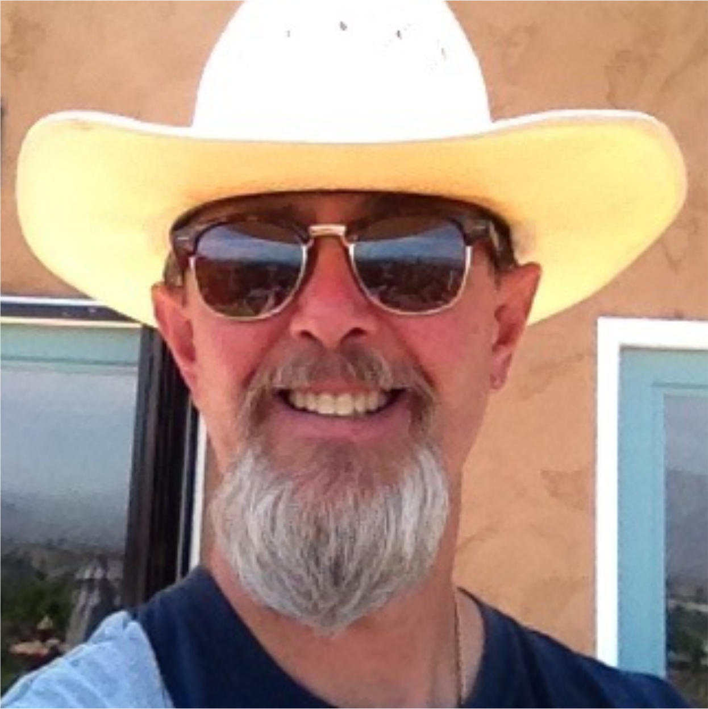

{:.avatar}

#James Orduno
Computer Science Student and Technology aficionado

<a href="mailto:">jorduno19@gmail.com</a>
|
<i class="fa fa-github"></i> <a href="http://github.com/">my account</a>
|
<i class="fa fa-twitter"></i> <a href="http://twitter.com/">mytwitteraccount</a>

## Currently

I'm a final-year computer science student at the University Computers, due to finish around September 2016. During my bachelor's degree I've taken up an interest in mobile technologies and artificial intelligence.

## Education

`2008-12`
__San Francisco State University__ Bachelor's degree in Urban Studies and Planning

`2017-18`
__SoftStack Factory__ Meanstack Coding Bootcamp

## Technical skills

* HTML and CSS
* Javascript

## Projects

### CV

I created a this web page to show off my CV.  

## Achievements

Achievement 1

Achievement 2

## Experience

`2010-11`
__Roasted Bean Coffe House__ 
 Worked for two summers on the Roasted Bean Coffe House as a barista.

## Hobbies

* Hiking
* Riding 
* Cooking

## Links

* <i class="fa fa-envelope"></i> <a href="mailto:">jorduno19@gmail.com</a> 
* <i class="fa fa-github"></i> <a href="http://github.com/">my account</a> 
* <i class="fa fa-twitter"></i> <a href="http://twitter.com/">mytwitteraccount</a> 
<!--* <i class="fa fa-stack-overflow"></i> <a href="http://stackoverflow.com/">SO Account</a>-->
<!--* <i class="fa fa-google"></i> <a href="http://scholar.google.com/">scholar</a>-->
